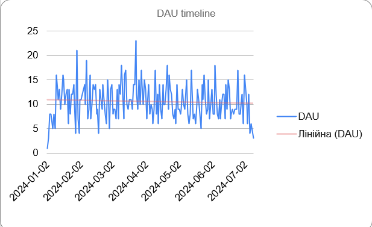
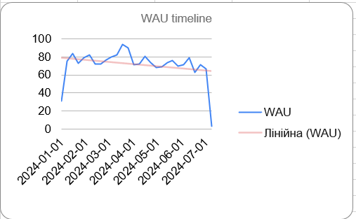
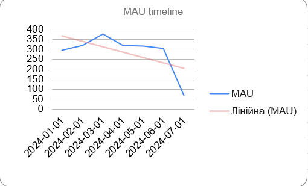
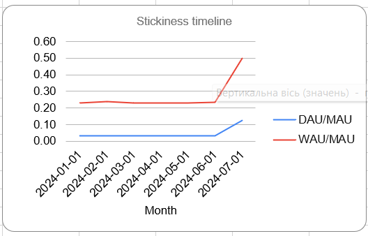

# 📊 Product Activity Analysis using Google Sheets

Analysis of user engagement and product stickiness using DAU, WAU, and MAU metrics for an e-commerce product.

---

## 📌 Project Overview

This project analyzes user purchasing activity for an e-commerce product using Google Sheets. The goal is to measure user engagement over time by calculating Daily Active Users (DAU), Weekly Active Users (WAU), Monthly Active Users (MAU), and product stickiness metrics. The analysis also includes trend visualization to support product decision-making.
---

## 🎯 Business Problem

After launching a new purchasing feature, the product team wanted to evaluate how user engagement changed over time. The objective was to measure daily, weekly, and monthly user activity, identify engagement trends, and assess product stickiness using industry-standard product metrics.

The analysis aimed to answer the following business questions:

- How does user activity change over time?
- Are users returning to the product regularly?
- Are there any seasonal or behavioral trends?
- How sticky is the product based on user activity?
---
## 🛠 Tools & Technologies

- Google Sheets
- Spreadsheet Functions (FILTER, UNIQUE, SORT, VLOOKUP, XLOOKUP, AVERAGEIFS)
- Date & Time Functions
- Data Visualization
- Product Analytics Metrics

---

## 📊 Metrics

- Daily Active Users (DAU)
- Weekly Active Users (WAU)
- Monthly Active Users (MAU)
- Average DAU
- Average WAU
- DAU / MAU Stickiness
- WAU / MAU Stickiness
---

## 🔍 Analysis Process

The analysis was completed in several stages:

1. Filtered the dataset to include only purchase events.
2. Converted timestamps into daily, weekly, and monthly date dimensions.
3. Calculated Daily Active Users (DAU), Weekly Active Users (WAU), and Monthly Active Users (MAU).
4. Measured average daily and weekly activity within each month.
5. Calculated DAU/MAU and WAU/MAU stickiness ratios.
6. Built line charts to visualize engagement trends over time.
7. Analyzed the results to identify user engagement patterns and product stickiness.
---

## 📈 Dashboard Preview

### Daily Active Users

### Weekly Active Users

### Monthly Active Users

### Product Stickiness

## 📈 Key Findings

The analysis of user activity revealed several important patterns:

- **Monthly Active Users (MAU)** reached their highest level in **March**, indicating the strongest overall user engagement during the analyzed period.
- **MAU declined significantly in July**, suggesting a noticeable drop in the number of active users.
- **Daily Active Users (DAU)** remained relatively stable throughout most of the observation period, demonstrating consistent daily engagement.
- **Weekly Active Users (WAU)** showed a downward trend toward the end of the analyzed period.
- **The highest DAU/MAU ratio was observed in July.** This increase was primarily driven by a sharp decrease in MAU rather than a growth in daily activity.
- **WAU/MAU remained relatively stable** across most months, indicating consistent weekly user engagement.

## 💼 Business Recommendations

- Investigate the reasons behind the significant decline in Monthly Active Users during July.
- Monitor DAU/MAU together with absolute user counts to avoid misleading conclusions.
- Continue tracking user engagement metrics to identify long-term behavioral trends.

## 🚀 Skills Demonstrated

- Product Analytics
- KPI Calculation
- User Engagement Analysis
- Time Series Analysis
- Spreadsheet Modeling
- Data Visualization
- Business Analysis

## 📚 What I Learned

Through this project I learned how to:

- Calculate and interpret DAU, WAU, and MAU metrics.
- Measure product stickiness using DAU/MAU and WAU/MAU ratios.
- Transform timestamps into business-friendly date dimensions.
- Build trend visualizations in Google Sheets.
- Translate analytical results into business recommendations.

